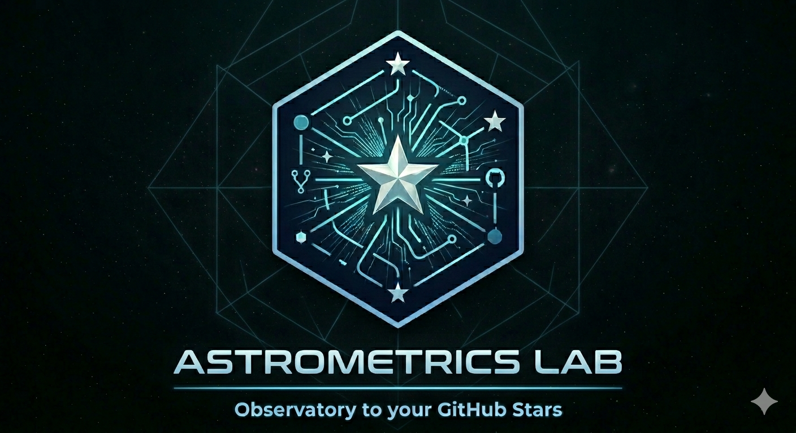

# Astrometrics Lab

<p align="center">
	
</p>

Astrometrics Lab is a Go CLI and Bubble Tea TUI for managing GitHub stars and star lists safely.

This is still just a proof of concept. It is not distributed or licenced, yet.

## Quick Start (macOS)

### Prerequisites

Install Go using Homebrew:

```bash
brew install go
```

Verify the installation:

```bash
go version
```

### Build and Run

Clone the repo and build:

```bash
git clone https://github.com/Relequestual/astro-lab.git
cd astro-lab
go build -o astlab ./cmd/astlab/
```

Run the CLI:

```bash
./astlab --help
```

### Run Tests

```bash
go test ./...
```

## Project Docs

- `docs/Copilot Agent build prompt.md`
- `docs/Astrometrics Lab - feasibility and technical notes.md`

## Scope (MVP)

- Dual auth: token first, gh fallback.
- Safe list membership updates with dry-run default.
- Sync and full reconciliation commands.
- Test coverage for core sync, mutation safety, and auth behavior.
